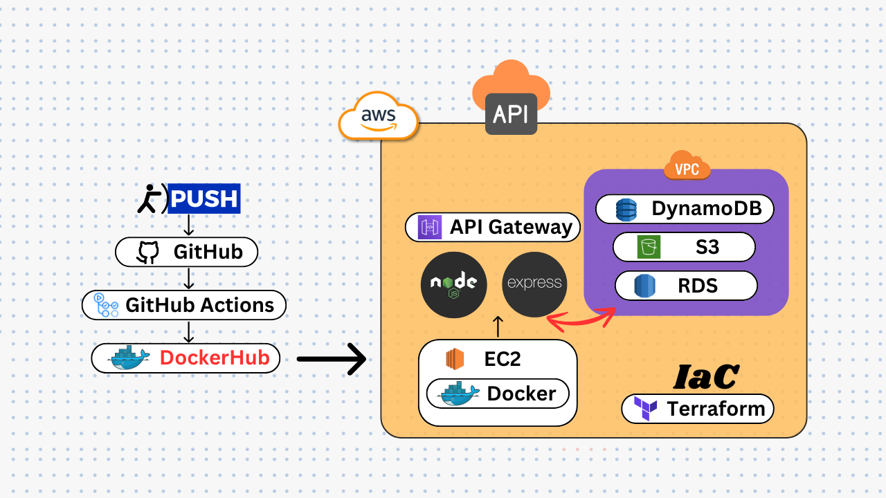

# Building and Deploying a Node.js + Express API with AWS Services Using Terraform and GitHub Actions
## [📖 Medium Article](https://medium.com/@madhurajayashanka/building-and-deploying-a-node-js-express-api-with-aws-services-using-terraform-and-github-actions-7dd53318f855)

This guide walks through the process of building and deploying a Node.js + Express.js API connected to various AWS services using Terraform and GitHub Actions. By the end of this guide, you'll have a robust CI/CD pipeline that automates the deployment of your Node.js application.

## Key Components

### 1. Node.js + Express.js
- Node.js: A JavaScript runtime environment.
- Express.js: A minimalist web framework for Node.js, ideal for building RESTful APIs.

### 2. AWS Services
- S3: Amazon Simple Storage Service for storing and retrieving any amount of data.
- DynamoDB: A key-value and document database with single-digit millisecond performance.
- RDS: Amazon Relational Database Service for operating and scaling relational databases.
- EC2: Amazon Elastic Compute Cloud for hosting Dockerized applications.
- API Gateway: Amazon API Gateway for creating, publishing, and securing APIs.

### 3. Terraform
- An open-source Infrastructure as Code (IaC) tool for provisioning AWS resources.

### 4. Docker
- A platform for developing, shipping, and running applications inside containers.

### 5. GitHub Actions
- A CI/CD service for automating software workflows directly from GitHub repositories.

## Workflow Overview

1. **Code Commit:** Developers push changes to a specified branch in the GitHub repository.
2. **CI/CD Pipeline:** GitHub Actions triggers, checking out code, installing dependencies, running tests, building a Docker image, and pushing it to DockerHub.
3. **Deployment:** The EC2 instance pulls the latest Docker image from DockerHub, stops the previous container, and runs the new one.
4. **Accessing the API:** Users interact with the API through Amazon API Gateway, routing requests to the Node.js application running inside Docker on the EC2 instance.

## Prerequisites

- Basic knowledge of Node.js and Express.js.
- An AWS Free Tier Account configured on your PC.
- Terraform installed on your local PC.
- DockerHub Account.

## Folder Structure

All the necessary codes and files are included in the GitHub repository.

## Step-by-Step Guide

1. **Terraform Setup:**
   - Modify variables in the `variables.tf` file.
   - Navigate to the Terraform directory and run `terraform init`, `terraform plan`, and `terraform apply`.

2. **GitHub Actions Configuration:**
   - Define CI/CD workflows in the `main.yml` file inside the `.github/workflows` directory.
   - Handle Docker image building and pushing to DockerHub.

3. **Self-Hosted Runner Setup:**
   - Access repository settings on GitHub.
   - Open Actions settings and add a new self-hosted runner.
   - SSH to your EC2 instance and configure the runner.

4. **Deployment and Testing:**
   - Commit changes to the GitHub repository to trigger the CI/CD pipeline.
   - Access the deployed API at `http://[EC2 IP]:5000`.
   - Access Swagger documentation for testing purposes at `http://[EC2 IP]:5000/api-docs`.

5. **Resource Cleanup:**
   - Terminate all AWS resources using the `terraform destroy` command to avoid unnecessary costs.

## Conclusion

In this guide, we've walked through building and deploying a Node.js + Express.js API connected to various AWS services using Terraform and GitHub Actions. By following the step-by-step guide, developers can streamline their development workflow, automate deployment tasks, and ensure consistency and reliability in their application deployments.

Happy coding! 🚀🌟

## Resources

- [📚 Medium Article](https://medium.com/@madhurajayashanka/building-and-deploying-a-node-js-express-api-with-aws-services-using-terraform-and-github-actions-7dd53318f855)

